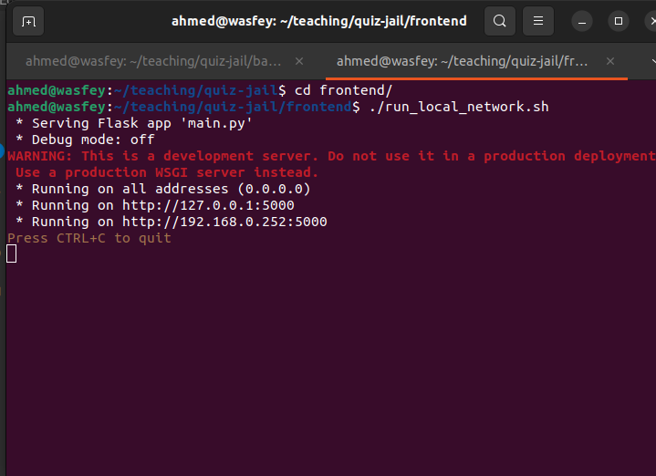
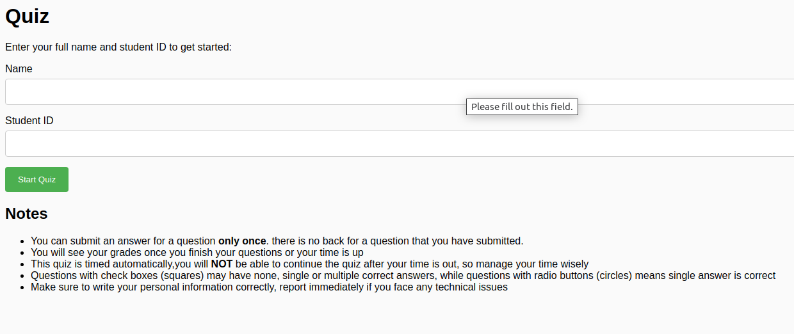
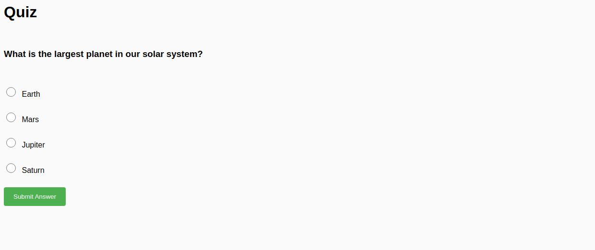
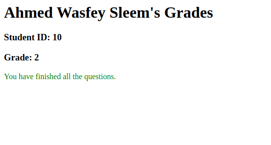
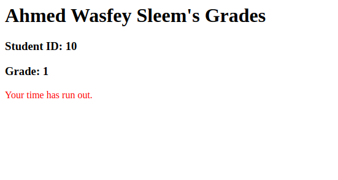
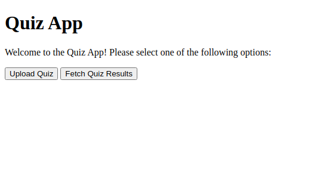
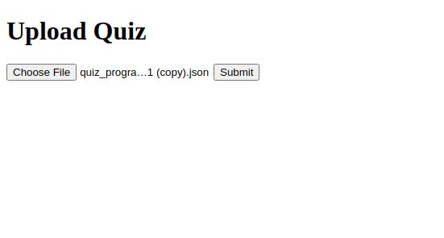
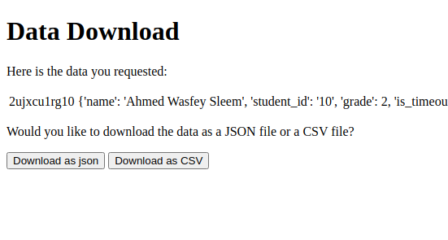

## Quizzes with maximum security :"D

This repository contains the code for a quiz application that is inspired from linkedin assessment that have time limit and you cannot go back to the questions you have answered, further more for every student the questions are shuffled and at the end you can download results as json or csv file.

### Start your quiz 
- create a `json` file with your questions in the following format 

```
[
  {   
    "question": "What is the capital of France?",    
    "answer": "Paris",    
    "choices": ["London", "Paris", "Madrid", "Rome"],
    "question_type": "radio"
  },
  {
    "question": "Which of the following are types of cats?",
    "answer": ["Siamese", "Persian", "Maine Coon"],
    "choices": ["Siamese", "Persian", "Maine Coon", "Golden Retriever"],
    "question_type": "checkbox"
  }
]
```
- by default the quiz will have 10 mins time limit for every student starts from the time he/she logins to the platform to change this you can format you `questions.json` file as 
```
{quiz_time: time_limit_in_minutes, questions: questions_formatted_like_above}
```
- Start the backend server and upload your file as described below 
- Start the frontend server, students can start the quiz and will see their grades at the end
- download the results 
### Frontend

The frontend service is a web application that allows students to login and take a quiz. The questions are shuffled for each student, and students are not able to go back to a question once it has been submitted. The grades are displayed at the end of the quiz.

To run the frontend service locally, navigate to the `frontend` folder and run the `run_local_network.sh` script:

```
cd frontend
./run_local_network.sh
```
this will allow students to access the platform as long as you are connected to the same local network. 

- you can find the link for local for this example `http://192.168.0.252:5000` students can use this link directly: 
- to make the quiz work remotely you can use any free cloud service for deployment or you can run locally and use any tunnelling service like `ngrok` 

### Backend

The backend service is a web application that provides the API for uploading and downloading quizzes.

To run the backend service locally, navigate to the `backend` folder and run the `run_local_network.sh` script:


To access the main page of the backend service, open a web browser and navigate to `http://localhost:8500`. From there, you can access the pages for uploading and downloading quizzes.


```
cd backend
./run_local_network.sh
```

### Images

Here are some images to help illustrate the steps described above:

#### Frontend

- Student login page: 
- Quiz page: 
- Results page: 
- Results page(Time out): 

#### Backend

- Main page: 
- Upload page: 
- Download page: 

I hope this information helps! Let me know if you have any other questions.

## Disclaimer
- shout out for chatGPT for helping me, thanks for all developers out there, actually it has learned from them :D 

- This project is a small, personal project for non-commercial use. It is not intended for professional or commercial use and does not support multiple quizzes ( for different courses for example) running at the same time.

## Further Work

There are several potential areas for further work on this project, including:

- Docker containerization: The frontend and backend services could be containerized using Docker to make it easier to deploy and run the application in different environments.
- Docker compose: The frontend and backend services could be composed together using Docker Compose to create a single, easy-to-use command for starting the entire application.
